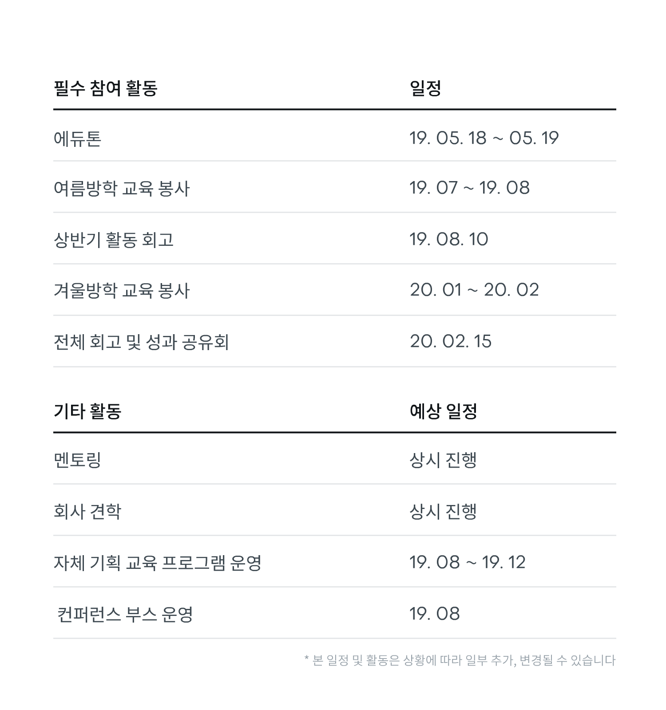
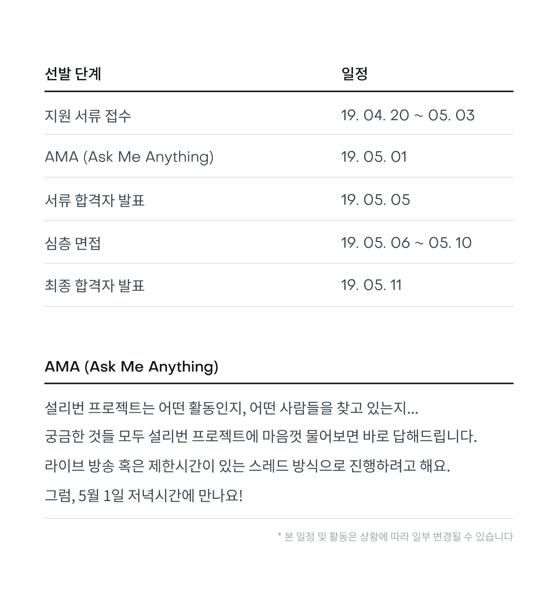

# 설리번 프로젝트 2019

## 설리번 프로젝트란 🤔

설리번 프로젝트는 ‘만들고 싶은 것을 코딩으로 만들어요’ 라는 슬로건 아래에 기술로서 본인만의 결과물을 직접 만들어 본 고등학생들이 선생님이 되어 교육 커리큘럼을 제작하여 지역의 또래 학생들에게 진행하는 교육 봉사 프로젝트입니다.

설리번 프로젝트는 수업을 듣는 모든 사람들이 자신만의 결과물을 만들어볼 수 있는 교육을 합니다. 교육을 만드는 학생들은 본인이 무언가를 만드는 과정에서 어려웠던 점, 바꾸고 싶었던 점을 적극적으로 교육에 반영하며, 직장 및 학교 선배들은 지식을 어떻게 잘 전달할 수 있는지 학생들과 함께 고민합니다.

2015년에 시작한 설리번 프로젝트는 현재까지 총 1,600 여 명의 또래 학생들에게 5,000시간 이상 교육을 진행하였으며, Microsoft Korea, JA Korea 등과 협력하여 여러 교육 프로그램을 기획 / 진행하였습니다.

## 연간 활동 📅

### 에듀톤 `필참`

에듀톤은 해당 연도에 교육을 진행하는 모든 설리번 선생님들이 모여 해커톤 형식으로 진행되는 무박 2일의 교육 프로그램입니다.

같은 꿈을 꾸고 있는 또래 친구들과 서로 친해지고, 교육을 진행하는 데 필요한 지식과 유의사항을 습득할 수 있으며, 서로 팀을 구성하여 1년간 진행/발전시킬 교육 프로그램의 초안을 구성합니다.

> 설리번 프로젝트에서는 원활한 교육 진행을 위해 1인 교육은 가급적 지양하고 있습니다.
> 에듀톤에 참여하지 않을 경우, 이후 진행되는 설리번 프로젝트의 교육 프로그램에 참여할 수 없습니다.

### 연간 교육 봉사 `필참`

설리번 프로젝트는 매년 방학기간 동안 지금까지 구성한 교육 커리큘럼을 또래 학생들에게 진행합니다. 교육 진행 장소 및 공간, 학생 지원 등이 교육 진행 1~2달 전에 진행됩니다.

2019년부터는 ''여름방학''에도 교육을 진행하여, 연 2회의 교육 봉사를 진행합니다.

### 멘토링

교육 커리큘럼을 구성하는 과정에서 선생님들에게 교육적 테크닉을 전달하는 '교육 멘토'와 각 커리큘럼의 최종 목표인 ‘결과물 만들기’를 기술적으로 구현 및 검토하는 '기술 멘토'가 각 교육 팀에 배정됩니다.

설리번 프로젝트에서 교육을 진행해본 경험이 있는 분들, 현업 종사자 분들이 멘토로 참여하고 있으며, 멘토링을 통해 교육 커리큘럼의 퀄리티를 높이고 준비 과정에서 드는 어려움을 조금이라도 줄여드리고자 합니다.

### 기타 활동들

컨퍼런스 부스 운영, 라이트닝 토크, 회사 견학 등의 여러 행사가 계획되고 있습니다.  
부족한게 있다면 같이 고민해주세요 😉

------

## 설리번 선생님을 찾습니다 🧐

2019년, 새롭게 시작하는 설리번 프로젝트의 '설리번 선생님'을 찾습니다.  
아래 내용을 참조하시어 **5월 3일 자정**까지 지원해주시기 바랍니다.

### 개요

2019년, 처음으로 설리번 프로젝트는 외부 학생들의 설리번 선생님 지원을 허용할 예정입니다.  
이번에 선발되는 분들은 설리번 프로젝트를 운영하는 '거점학교' 소속으로 활동을 하게 될 예정입니다.

거점학교의 운영진들로부터 운영 및 전달 사항 등 대부분의 관리를 받게 되며, 학교 별로 자체적으로 진행하는 프로그램에 참여할 수 있습니다. 또한, 온라인으로 혹은 학교에 방문하여 주간회의 등에 참석하게 됩니다.

(자세한 내용은 학교 별 운영 방침에 따라 다소 상이할 수 있습니다)

### 설리번 프로젝트 거점학교 🎒

- 한국디지털미디어고등학교 (경기 안산)
- 한국애니메이션고등학교 (경기 하남)
- 대덕소프트웨어마이스터고등학교 (대전)
- 한세사이버보안고등학교 (서울 남부)

### 이렇게 선발할 예정이에요 🏃

#### 1차 서류 평가

아래의 자료를 5월 3일 자정까지 제출해주세요.

- **지원서** - 기본 인적사항 및 경험/가치에 대한 내용 작성
- **영상과제** -  '코딩을 배워야 하는 이유'를 5분 이내로 설명하는 강의 영상을 찍어 제출

#### 2차 심층 면접

학교 별 운영진과 중앙 운영진이 참여한 2:1 면접을 진행합니다. 면접을 통해 활동 가치와 목적에 부합하는지, 서류/영상과 일치하지 않는 부분이 없는지 종합적으로 평가합니다.

#### 최종 합격자 발표

최종 합격자를 발표하고 활동에 필요한 추가 서류를 작성합니다.
여기까지 오면, 당신도 어엿한 설리번 프로젝트의 설리번 선생님!

### 이런 사람을 찾고 있어요 👋

- **코딩을 잘하는 사람을 찾는 게 아니에요!**
- **중~고등학생** 연령대의 분들이어야 해요
- **만들고 싶은 것을 끝까지 만들어 본 경험**이 있어야 해요 (코딩 아니어도 됨)
- **필.참. 일정에 무조건 참여**할 수 있어야 해요
- 빠르게 배우고 배운 것을 남과 공유하려는 분일 수록 좋아요
- 설리번 프로젝트의 수업을 들어본 분일 수록 좋아요
- 교육 혹은 봉사 경험이 많으신 분일 수록 좋아요

#### [지원서 다운로드](https://drive.google.com/drive/folders/1DFx8Gp2FiRfQdjloyxUoJzeZwxEvYwJu?usp=sharing)

#### [지원하기](https://drive.google.com/drive/folders/1DFx8Gp2FiRfQdjloyxUoJzeZwxEvYwJu?usp=sharing)

------

## FAQ 🙋‍♀️

> **Q. 잠깐, 저는 거점학교에 다니고 있는데, 저도 지원할 수 있나요?**
>
> 한세사이버보안고등학교를 제외한 나머지 학교의 학생들은 지원하실 수 없습니다. 만약 지원할 경우 서류는 자동적으로 무효 처리합니다.  
> 2020년에 진행될 6기 설리번 프로젝트 선발 과정에 참여해주세요 😿

> **Q. 여러 거점학교에 중복 지원이 가능한가요?**
>
> 불가능합니다.

## 궁금하신게 있으신가요? 👽

- [페이스북 페이지](https://fb.com/sullivanproject.in)
- 이메일 ([contact@sullivanproject.in](mailto://contact@sullivanproject.in))